# Tutorial in Reinforcement Learning of the [RL-Bootcamp Salzburg 24](https://sarl-plus.github.io/RL-Bootcamp/)

## Getting Closer to Real-World Reinforcement Learning Applications - the AWAKE RL Playground

[Simon Hirlaender](https://mathphyssim.github.io), Olga Mironova , Catherine Laflamme, Thomas Gallien, Marius-Constantin Dinu

**Contact:** [simon.hirlaender@plus.ac.at](mailto:simon.hirlaender@plus.ac.at) or [sarl.ida.plus@gmail.com](mailto:sarl.ida.plus@gmail.com)

Welcome to the **RL Bootcamp Tutorial**! This tutorial guides you through implementing reinforcement learning (RL) techniques for beam steering in a control-theoretical framework. We'll explore various approaches, compare their effectiveness, and conduct a comprehensive noise study to evaluate performance under different conditions.

Before we start, these are the **learning goals**:
## Learning goals:
- Learn the basics of episodic control problems in a didactic and visual way
- Learn basics to find a good policy in a linear continuous MDP
- Learn the complexity in applying different approaches and gradually increase the complexity of a problem
- Get an idea where to start when having an individual problem
- Learn how to implement different approaches
- Learn how to get reproducible results when running these kind of optimisation
- Learn how to control an accelerator at CERN
- Learn how to train an RL agent out of the box - if you are advanced be creative!

## Specific situations - todos:
- Rewards shaping by modifiyng the penalty
- Increasing the complexity of the problem
- Try hyperparameters of the algorithms RL Agents
- Help and contribute section

[//]: # (- TOC has to be correct)

[//]: # (- credits for GP-MPC and reference)

[//]: # (- credits AWAKE)

[//]: # (- credits on papers)
## How we do the tutorial
- We will make subgroups with at least one expert in each group
- **Group discussions:**
   - Please discuss questions.
   - Facilitate sessions where learners and experts debate and reach consensus on RL concepts and implementation strategies.

[//]: # (# Open questions for the programme? - these are the notes I took during our discussions:)

[//]: # ()
[//]: # (Advanced part:)

[//]: # (   1. Elements of model-based RL)

[//]: # (   2. Elements of data-driven MPC design and optimization)

[//]: # (   3. Gaussian processes in a nut-shell)

[//]: # (   4. Running GP-MPC on the AWAKE environment)

[//]: # (   5. Alternative advanced ideas - non-stationary &#40;shifts&#41;, masking, domain randomization, domain generalisation.)

[//]: # ()
[//]: # (1. MDP shaping as a part of the tutorial also as a contest?)

[//]: # ()
[//]: # (2. One of the main goals is to understand every aspect of the &#40;an&#41; MDP:)

[//]: # (   * We discuss the dynamics of the system, actions and states)

[//]: # (   * We discuss the initial distribution of the states and it's role)

[//]: # (   * We discuss the reward function and its equivalence classes)

[//]: # (   * The episodic formulation within the MDP world - modification of termination/truncation criteria)

[//]: # (   * Beyond MDP - POMDPs  by modifying the dynamics &#40;non-stationary&#41;)

[//]: # (3. Difference between noise and partially observability - where to draw the line?)

## Achievements:
### What should people learn?
- Understanding the basics of Reinforcement Learning (RL).
- Key components: agents, environments, states, actions, rewards, and policies.
- Differences between RL and other machine learning paradigms and classical optimization.
- Hands-on experience with simple RL algorithms like PPO/TRPO and tuning of such algorithms.
- Practical applications and limitations of RL.
- Working with gymnasium and wrappers

### What are common pitfalls in the beginning?
- Underestimating the complexity of tuning hyperparameters.
- Overfitting to a specific environment or task.
- Misinterpreting results due to stochastic nature of RL.
- Neglecting the importance of exploration vs. exploitation trade-off.
- Insufficient computational resources for training complex models.

### What are the most important concepts?
- **Agent:** The learner or decision maker.
- **Environment and MDPs:** The external system with which the agent interacts.
- **State:** A representation of the current situation of the agent.
- **Action:** A set of all possible moves the agent can make.
- **Reward:** Feedback from the environment to evaluate actions.
- **Policy:** The strategy that the agent employs to determine the next action based on the current state.
- **Value Function:** A prediction of future rewards.
- **Exploration vs. Exploitation:** Balancing the act of trying new actions vs. sticking to known rewarding actions.

### What can RL do for you?
- Solve complex decision-making problems.
- Optimize strategies in various fields like finance, robotics, gaming, and healthcare.
- Improve efficiency in dynamic systems by learning optimal policies.

### Why use RL? Is it the last hope?
- RL is used when there is a clear objective but the path to achieve it is not predefined.
- It's powerful for problems where the environment is dynamic and the agent needs to adapt and learn from interactions.
- While not the "last hope," RL provides a robust approach to problems where traditional methods fall short.

-
# Table of Contents

- [Introduction](#introduction)
  - [Problem Definition](#problem-definition)
    - [CERN Advanced WAKe (AWAKE) field Experiment](#cern-advanced-wake-awake-field-experiment)
    - [Environment Properties and Markov Decision Process (MDP) Definition](#environment-properties-and-markov-decision-process-mdp-definition)
    - [Why This Environment?](#why-this-environment)
  - [Approaches to solve the control problem](#approaches-to-solve-the-control-problem)
    - [Model Predictive Control (MPC)](#model-predictive-control-mpc)
    - [Reinforcement Learning (RL)](#reinforcement-learning-rl)
    - [Analytical approach](#analytical-approach)
- [Noise Study](#noise-study)
- [Getting Started](#getting-started)
  - [1. Configuration](#1-configuration)
  - [2. Running Model Predictive Control](#2-running-model-predictive-control)
  - [3. Training RL Agents](#3-training-rl-agents)
  - [4. Comparing Approaches](#4-comparing-approaches)
- [Environment Components](#environment-components)
- [Additional Resources](#additional-resources)
- [Contributing](#contributing)
- [License](#license)

---

# Introduction

## Problem Definition
### CERN Advanced WAKe (AWAKE) field Experiment

In this tutorial, we define a **Beam Steering Environment** where the goal is to control beam parameters to achieve desired states. The environment is modeled using control theory principles, incorporating dynamic response matrices and state-space representations. The reinforcement learning agent interacts with this environment by selecting actions that influence the beam's state, aiming to minimize deviations from target parameters.

The AWAKE at CERN is a groundbreaking physics experiment designed to explore and demonstrate the use of plasma wakefields driven by a proton beam to accelerate charged particles, specifically electrons, to high energies over short distances. This technique, known as plasma wakefield acceleration, has the potential to revolutionize the field of particle acceleration.

In the AWAKE experiment, a high-energy proton beam from CERN's SPS (Super Proton Synchrotron) is sent into a 10-meter-long plasma cell. This proton beam creates a wake in the plasma — a series of electric fields that can accelerate electrons to energies of several GeV (giga-electron volts) within this relatively short distance. This method is significantly more efficient than traditional particle acceleration techniques, which require much longer distances to achieve similar energy increases.

The primary goals of the AWAKE experiment include validating the concept of proton-driven plasma wakefield acceleration, understanding the dynamics of the process, and exploring its potential applications in future particle accelerators. This experiment not only aims to advance our understanding of plasma physics but also seeks to develop more compact and cost-effective particle accelerators.


The electron line in the AWAKE experiment at CERN is a crucial component designed to inject a beam of electrons into the plasma cell where wakefield acceleration occurs. This part of the setup is strategically positioned just before the plasma cell and plays a pivotal role in the overall acceleration process. Here's a detailed description of the electron line right before the plasma cell:

#### Configuration and Function

The electron line consists of several key elements, including electron sources, focusing magnets, diagnostics, and beamline elements that precisely align and focus the electron beam into the plasma cell. The configuration is carefully designed to synchronize the electron beam injection with the proton beam-induced plasma wakefields. 

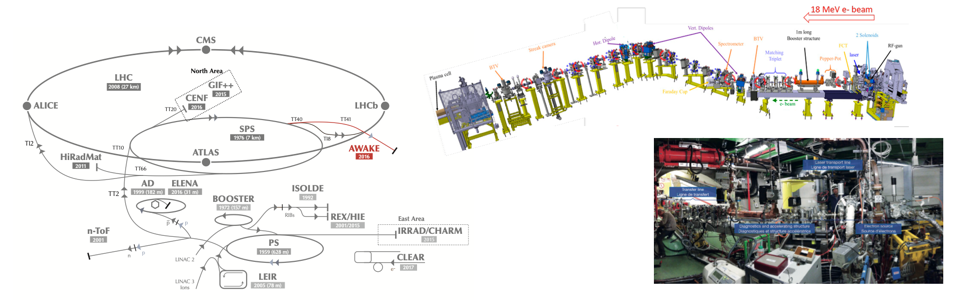

#### Electron Beam Preparation

1. **Electron Source**: The electron line starts with an electron gun, which generates a beam of electrons. This source is capable of producing a high-quality beam with the necessary energy and bunch characteristics required for effective wakefield acceleration.

2. **Acceleration**: After generation, the electron beam is accelerated to the required energy, typically in the range of several MeV (mega-electron volts). This acceleration is achieved using a linear accelerator (linac) component, which rapidly boosts the electron energy to the levels needed for injection into the plasma.

3. **Focusing and Diagnostics**: The beam is then passed through a series of magnetic lenses and quadrupoles that focus the beam and maintain its coherence. Beam diagnostics are also employed extensively along the electron line to monitor beam properties such as energy, emittance, and alignment. These diagnostics are critical for ensuring that the electron beam parameters are optimized for interaction with the plasma wakefields.

4. **Synchronization**: Synchronization mechanisms ensure that the electron beam is precisely timed to enter the plasma cell in coordination with the proton beam. This timing is critical, as the electrons must enter the plasma wakefields at the right phase to gain maximum acceleration from the energy transfer.

#### Entry into the Plasma Cell

Just before entering the plasma cell, the electron beam undergoes final adjustments and checks to confirm its alignment and energy. The entry point is equipped with additional diagnostics and control mechanisms to make any last-minute corrections based on real-time data. As the electrons enter the plasma, they encounter the wakefields generated by the high-energy proton beam passing through the plasma just moments earlier.

This precise insertion into the wakefield allows the electrons to be rapidly accelerated over a short distance, gaining significant energy from the wakefields created by the proton beam in the plasma. The effectiveness of this entire process hinges on the precise control and optimization of the electron line, showcasing its importance in the AWAKE experiment.

We focus on the part, right before entering the plasma cell. The steering problem, we want to solve in our tutorial is shown in the following image:
Here we see the first five elements (dregrees of freedom: $N=5$) of the electron line. Here the state at time $t$ is $\mathbf s_t:=\text{target_trajectory}-\text{current_trajectory} = (s_{1,t},s_{2,t}s_{3,t}s_{4,t}s_{5,t})$ and an action is $\mathbf a_t = (a_{1,t}, a_{2,t}, a_{3,t}, a_{4,t}, a_{5,t})$. 
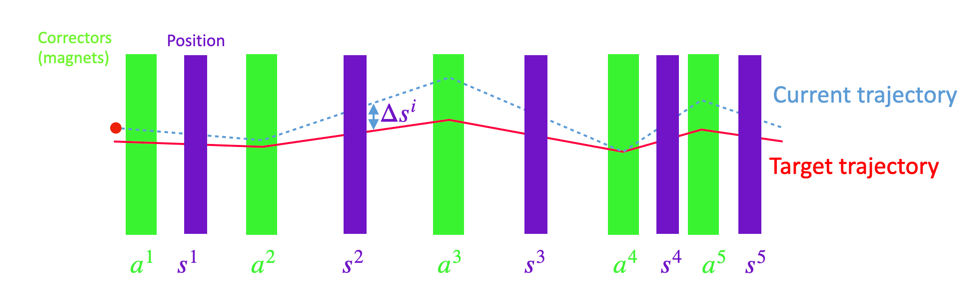

We want to bring the current trajectory (blue) to a target trajectory (red) as fast as possible (then $\mathbf s_t = \mathbf 0$) by modifying the magnets (violet).
### Environment Properties and Markov Decision Process (MDP) Definition

The **Beam Steering Environment** is formally defined as a Markov Decision Process (MDP) with the following components:

- **State Space ($\mathcal{S}$):**
  A $N$-dimensional (10 in the real scenario) continuous space representing the current beam positions and related parameters. Each state $ \mathbf{s}_t \in \mathcal{S} $ is a vector of real numbers capturing the system's state at time step $ t $.

- **Action Space ($\mathcal{A}$):**
  A $N$-dimensional (10 in the real scenario) continuous space corresponding to control inputs, such as corrector magnets. Actions $ \mathbf{a}_t \in \mathcal{A} $ are bounded to satisfy physical constraints, ensuring safe and feasible control actions.

- **Observation:**
  The observation provided to the agent is identical to the state $ \mathbf{s}_t $.

- **Reward Function ($R$):**
  The reward is defined as the negative Root Mean Square (RMS) of the state vector:
  $$
  R(\mathbf{s}_t) = -\sqrt{\frac{1}{N} \sum_{i=1}^{N} s_{t,i}^2}
  $$

- **Dynamics:**
  The system dynamics (linear time invariant) are characterized by:
  $$
  \mathbf{s}_{t+1} = \mathbf{B} \mathbf{a}_t + \mathbf{I} \mathbf{s}_t
  $$
  where $ \mathbf{B} $ is the response matrix and $ \mathbf{I} $ is the identity matrix.

[A good resource for linear dynamics and control](#a-good-resource-for-linear-dynamics-and-control)

- **Initial Criteria:**
  States are initialized based on an initial distribution ($\mathbf s_0\sim \rho$), typically a uniform distribution centered around the desired beam position within ($\mathcal S$).

- **Training Paradigm:**
  The environment operates in an episodic manner, where each episode consists of a sequence of interactions (changes of $\mathbf a$) until termination criteria are met.

- **Termination Criteria:**
  An episode can terminate under the following conditions:
  1. **Maximum Number of Interactions (Truncation):**
     The episode ends if the number of time steps exceeds a predefined maximum limit (e.g., 1000 steps).

  2. **Successful Termination:**
     If the RMS of the state vector falls below the measurement uncertainty threshold, indicating successful beam steering.

  3. **Unsuccessful Termination:**
     If any state component exceeds the beam pipe boundaries, leading to an unsafe or failed steering attempt.

- **Discount Factor ($\gamma$):**
  The discount factor is set to $ \gamma = 1 $, indicating that future rewards are valued equally to immediate rewards, which can allways be done in episodic scenarios (reducing the hyperparameters by one ;).

<span style="color:pink">Why is the reward negative?</span>

### Why This Environment?

We chose the beam steering problem for its rich control dynamics and the inherent challenges it presents:

1. **Simple Dynamics:** Despite the high-dimensional nature, the system's dynamics are linear and well-defined, making it an ideal candidate for studying various control strategies and their effects comprehensively.

2. **Real-World Applicability:** Beam steering plays a crucial role in numerous applications, such as particle accelerators and optical systems, where precise control is paramount. This makes it an excellent domain for applying and evaluating reinforcement learning techniques in scenarios that mimic real-world complexities.

3. **Non-triviality:** The control problem introduces non-linear challenges. Unlike simpler linear models, the optimal paths in beam steering are not always straightforward and may not lead directly to the threshold in minimal steps. This complexity arises from the inherent non-linear responses within the system, demanding more sophisticated approaches for efficient control.

These characteristics render the beam steering problem both intriguing and significant, providing a practical and educational platform for testing and advancing RL algorithms. This blend of simplicity in understanding and complexity in execution makes it an exemplary case study in the realm of reinforcement learning.

---

## Approaches to solve the control problem
### 1. Model Predictive Control (MPC)

**Model Predictive Control (MPC)** is a traditional control strategy that optimizes a sequence of actions over a finite horizon to achieve desired outcomes. MPC utilizes an internal model of the system to predict future states and determine the optimal control actions accordingly.

#### Advantages:
- **Optimality:** MPC provides near-optimal solutions based on the system model, ensuring efficient control actions.
- **Constraint Handling:** Effectively manages constraints on states and actions, making it suitable for systems with physical or safety limitations.
- **Flexibility:** Can accommodate multi-variable control problems and handle various types of constraints seamlessly.

#### Drawbacks:
- **Model Dependence:** Requires an accurate model of the environment dynamics. Model inaccuracies can degrade performance.
- **Computational Complexity:** Can be computationally intensive, especially for large-scale or highly dynamic systems, potentially limiting real-time applicability.
- **Implementation Complexity:** Designing and tuning MPC controllers can be complex, requiring expertise in both control theory and optimization.

#### Mathematical Foundation:
Want to solve:
$$
\text{maximise}_{\pi_t} \lim_{T\to\infty}\mathbb E_{W_t}[\frac 1 T \sum_{t=0}^T R_t(S_t,A_t,W_t)]
$$
subject to the system dynamics:
$$
\mathbf{s}_{t+k+1} = \mathbf{A} \mathbf{s}_{t+k} + \mathbf{B} \mathbf{a}_{t+k}
$$
and:
$$
\mathbf{a}_{t} = \pi(s_t)
$$
and:
$$
\mathbf{s}_{0} = S_0 \qquad (given)
$$
MPC solves an optimization problem at each control step, minimizing a cost function over a prediction horizon $ N $:
$$
\text{maximise}_{\{a_t\}} \mathbb E_{W_t}[ \sum_{t=0}^{H-1} R_t(S_t,A_t,W_t)+ V(S_H)]
$$
subject to:
$$
\text{subject to: } S_{t+1}=f_t(S_t,A_t,W_t)
$$
and
$$
\mathbf{s}_{0} = S_0 \qquad (given)
$$

and any state or action constraints.


#### Comparison with Other Methods:
- **Versus Reinforcement Learning (RL):**
  - **Optimality vs. Adaptability:** While MPC seeks optimal control actions based on a predefined model, RL learns policies through interactions, offering greater adaptability to unforeseen dynamics.
  - **Model Requirement:** MPC requires an accurate system model, whereas RL can operate in a model-free manner, reducing dependence on precise modeling.
  - **Computational Load:** MPC can be more computationally demanding in real-time applications compared to some RL approaches, especially after the training phase.

- **Versus Analytical Approach:**
  - **Flexibility:** MPC can handle a wider range of constraints and multi-variable systems compared to the Analytical Approach, which is typically limited to linear and simpler systems.
  - **Optimality:** MPC provides a more systematic way to achieve near-optimal solutions through optimization, whereas the Analytical Approach relies on direct computation which may not always yield optimal results under constraints.


Model Predictive Control (MPC), also known as Receding Horizon Control or Moving Horizon Control, is a type of control algorithm that uses an optimization approach to predict and control the future behavior of a system. Here are some classical and foundational references on MPC that provide a deep understanding of its concepts, methods, and applications:
[References on Model Predictive Control (MPC)](#references-on-model-predictive-control-mpc) and [References on optimisation](#references-on-optimisation).

### 2. Reinforcement Learning (RL)

**Reinforcement Learning (RL)** offers a data-driven approach to control without explicit reliance on environment models. RL algorithms learn optimal policies through interactions with the environment, aiming to maximize cumulative rewards over time.

#### Advantages:
- **Model-Free:** Learns optimal policies directly from interactions, eliminating the need for precise models.
- **Flexibility:** Capable of handling complex, high-dimensional, and non-linear environments.
- **Adaptability:** Can continuously adapt to changing environments and dynamics through ongoing learning.

#### Drawbacks:
- **Sample Efficiency:** Often requires a large number of interactions to learn effectively, which can be time-consuming and resource-intensive.
- **Stability:** Training can be unstable and sensitive to hyperparameters, making the tuning process challenging.
- **Guarantees:** Only in specific Markov Decision Processes (MDPs) and with certain algorithms can performance guarantees be provided. Generally, these guarantees break down when using function approximators like neural networks.
#### Mathematical Foundation:
RL frameworks are typically defined by the MDP components: state space $ \mathcal{S} $, action space $ \mathcal{A} $, reward function $ R $, transition dynamics $ P $, and discount factor $ \gamma $. The goal is to find a policy $ \pi: \mathcal{S} \rightarrow \mathcal{A} $ that maximizes the expected cumulative reward:
$$
\pi^* = \arg\max_{\pi} \mathbb{E} \left[ \sum_{t=0}^{\infty} \gamma^t R(\mathbf{s}_t, \mathbf{a}_t) \right]
$$
#### Comparison with Other Methods:
- **Versus Model Predictive Control (MPC):**
  - **Adaptability vs. Optimality:** RL offers greater adaptability to dynamic and uncertain environments, whereas MPC provides near-optimal control based on a predefined model.
  - **Learning Requirement:** RL requires extensive training and interaction data, while MPC relies on a known system model, reducing the need for learning from scratch.
  - **Computational Efficiency:** Once trained, RL policies can be computationally efficient to execute, potentially outperforming MPC in real-time applications where optimization may be too slow.

- **Versus Analytical Approach:**
  - **Flexibility and Learning:** RL can handle more complex and non-linear dynamics by learning from data, whereas the Analytical Approach is limited to linear and simpler systems without learning capabilities.
  - **Optimality and Constraints:** The Analytical Approach provides deterministic control actions based on mathematical relationships, while RL seeks to maximize rewards, which may not always align with strict constraint handling unless explicitly incorporated.


By comparing MPC and RL, we aim to highlight the strengths and limitations of each approach in the context of beam steering.

[References on Reinforcement Learning](#references-on-reinforcement-learning)
### 3. Analytical Approach

The **Analytical Approach** leverages the inverse of the linear dynamics matrices to compute control actions directly. This method is grounded in classical control theory and offers a straightforward mechanism for beam steering without the iterative optimization processes inherent in MPC or the extensive training required in RL.

#### Advantages:
- **Simplicity:** Provides a direct computation of control actions using predefined mathematical relationships, simplifying the control strategy.
- **Computational Efficiency:** Typically faster than MPC and does not require iterative optimization, making it suitable for real-time applications with limited computational resources.
- **Deterministic Outcomes:** Produces consistent results given the same initial conditions and inputs, ensuring predictable control behavior.

#### Drawbacks:
- **Limited Adaptability:** Relies on the accuracy of the linear model; performance may degrade in highly non-linear or dynamic environments.
- **No Learning Capability:** Does not adapt or improve based on environmental interactions or feedback, limiting its effectiveness in changing conditions.
- **Sensitivity to Model Accuracy:** Errors in the inverse matrix or model parameters can lead to suboptimal or unstable control actions.
- **Does Not Account for Non-Linearities:** Struggles to handle non-linear dynamics, making it less effective in scenarios where such complexities are present.

#### Mathematical Foundation:
The Analytical Approach uses the inverse of the response matrix ($\mathbf{B}$) derived from the linear dynamics of the beam steering system. By applying this inverse matrix to the current state, the method calculates the precise control actions required to correct deviations from the desired beam position:
$$
\mathbf{a}_t = \mathbf {B}^{-1} \mathbf{s}_t
$$
where:
- $ \mathbf{s}_t $ is the state vector at time $ t $.
- $ \mathbf{a}_t $ is the action vector at time $ t $.
- $ \mathbb{B} $ is the response matrix.

#### Implementation in the Tutorial:
1. **Inverse Matrix Calculation:**
   - Compute the pseudo-inverse of the response matrix $\mathbf{B}$ to ensure numerical stability.
   - ```python
     import numpy as np

     self.rmatrix_inverse = np.linalg.pinv(self.rmatrix)
     ```

2. **Control Action Computation:**
   - Calculate the control action by multiplying the inverse matrix with the current state.
   - $$ \mathbf{a}_t = \mathbf{B}^{-1} \mathbf{s}_t $$
   - ```python
     action = -self.rmatrix_inverse.dot(state * self.state_scale)
     ```

3. **Action Scaling and Clipping:**
   - Scale the computed action and ensure it remains within predefined bounds. This scaling, combined with threshold termination criteria, makes the control problem non-trivial. Only in specific cases is the solution optimal.
   - ```python
     action = np.clip(action, -1, 1)
     ```

#### Comparison with Other Methods:
- **Versus Model Predictive Control (MPC):**
  - **Computational Efficiency vs. Optimality:** The Analytical Approach is less computationally intensive since it avoids the optimization process over a prediction horizon, offering faster control actions. However, MPC can handle constraints more effectively, providing near-optimal solutions that the Analytical Approach may not always achieve under constraints.
  - **Flexibility:** MPC offers greater flexibility in managing multi-variable and constrained systems compared to the Analytical Approach, which is typically limited to linear and simpler scenarios.

- **Versus Reinforcement Learning (RL):**
  - **Immediate Control vs. Learned Policies:** The Analytical Approach does not require training and provides immediate control actions, making it suitable for systems where training time is prohibitive. In contrast, RL methods require extensive training to learn effective policies but offer adaptability and can handle more complex, non-linear dynamics.
  - **Deterministic vs. Adaptive:** While the Analytical Approach produces deterministic outcomes based on the current state, RL offers adaptive control that can evolve with the environment, providing better performance in dynamic settings.

The Analytical Approach serves as a foundational control method that can be effective in environments with well-defined linear dynamics and minimal uncertainties. While it lacks the adaptability and learning capabilities of RL, it offers simplicity and computational efficiency, making it a valuable tool for benchmarking and comparison against more advanced control strategies like MPC and RL.

[References on the analytical approach](#references-on-the-analytical-approach)

### Comparison with MPC and RL:

* Versus MPC:
The Analytical Approach is less computationally intensive since it avoids the optimization process over a prediction horizon.
MPC can handle constraints more effectively, whereas the Analytical Approach relies on the inherent properties of the inverse matrix and action clipping.
* Versus RL:
The Analytical Approach does not require training and provides immediate control actions, whereas RL methods require extensive training to learn effective policies.
RL offers adaptability and can handle more complex, non-linear dynamics, which the Analytical Approach may struggle with.

The Analytical Approach serves as a foundational control method that can be effective in environments with well-defined linear dynamics and minimal uncertainties. While it lacks the adaptability and learning capabilities of RL, it offers simplicity and computational efficiency, making it a valuable tool for benchmarking and comparison against more advanced control strategies like MPC and RL.

## Preliminary conclusion RL with guarantees - a dream?:

Can we somehow get the advantages of having a model and purly learning from data?

Let us draw some conclusion in a sketch:
<div align="center">
  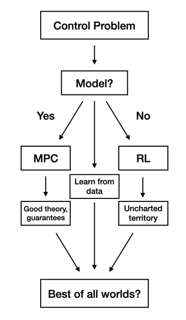
</div>

Model-Based Reinforcement Learning (MBRL) combines the strengths of model-based approaches with the adaptability of reinforcement learning. While MBRL offers enhanced sample efficiency and the potential for more informed decision-making, it also presents several significant challenges that can impact its effectiveness and applicability. Understanding these challenges is crucial for developing robust and efficient MBRL systems.

<div align="center">
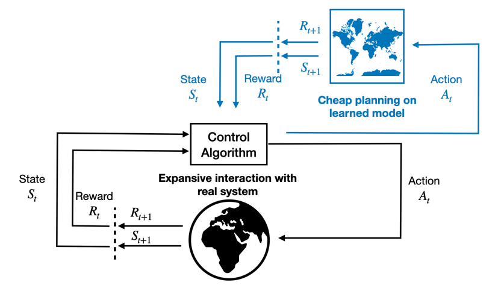
</div>

To give us an idea about the complexity of the method, let us look at the main challenges:

#### 1. **Model Accuracy**
   - **Description:** Learning an accurate model of the environment's dynamics is fundamental to MBRL. However, in complex or high-dimensional systems, capturing the true dynamics accurately can be exceedingly difficult.
   - **Impact:** Inaccurate models can lead to suboptimal or even detrimental control actions, as the agent relies on flawed predictions to make decisions.

#### 2. **Computational Complexity**
   - **Description:** MBRL involves both learning the environment model and planning based on that model. This dual requirement increases the computational burden compared to model-free approaches.
   - **Impact:** High computational demands can limit the applicability of MBRL in real-time or resource-constrained environments, where rapid decision-making is essential.

#### 3. **Error Propagation**
   - **Description:** Errors in the learned model can propagate through the planning and decision-making processes, exacerbating inaccuracies over time.
   - **Impact:** Compounded errors can degrade the performance of the RL agent, leading to unstable or inefficient control policies.

#### 4. **Balancing Exploration and Exploitation**
   - **Description:** MBRL agents often rely heavily on their models to make decisions, which can bias them towards exploiting known information and limit exploration of the state-action space.
   - **Impact:** Reduced exploration can hinder the discovery of optimal policies, especially in environments with sparse or deceptive reward signals.

#### 5. **Data Efficiency vs. Model Complexity**
   - **Description:** While MBRL is generally more data-efficient than model-free RL, achieving high model accuracy may require large and diverse datasets, especially for complex environments.
   - **Impact:** Gathering sufficient data to train accurate models can be time-consuming and resource-intensive, potentially negating some of the sample efficiency benefits.

#### 6. **Generalization and Transferability**
   - **Description:** Models trained in specific environments may struggle to generalize to new or slightly altered scenarios. Ensuring that the learned model remains effective across varying conditions is a significant challenge.
   - **Impact:** Poor generalization can limit the applicability of MBRL agents to dynamic or evolving environments, reducing their robustness and versatility.

#### 7. **Integration of Learning and Planning**
   - **Description:** Seamlessly integrating the processes of model learning and planning is non-trivial. Coordinating these components to work harmoniously without introducing instability is a complex task.
   - **Impact:** Inefficient integration can lead to delays in decision-making, increased computational overhead, and potential conflicts between the learning and planning modules.

#### 8. **Handling Uncertainty**
   - **Description:** Accurately quantifying and managing uncertainty in model predictions is crucial for reliable decision-making in MBRL. This includes both epistemic uncertainty (model uncertainty) and aleatoric uncertainty (inherent randomness).
   - **Impact:** Inadequate handling of uncertainty can result in overconfident predictions, leading to risky or unsafe control actions, especially in critical applications.

#### 9. **Scalability**
   - **Description:** Scaling MBRL methods to environments with large or continuous state and action spaces poses significant challenges. Ensuring that the model remains tractable and the planning process remains efficient is essential.
   - **Impact:** Limited scalability can restrict the use of MBRL to smaller or simpler systems, reducing its applicability to real-world, complex control problems.

#### 10. **Hyperparameter Tuning**
- **Description:** MBRL frameworks often involve numerous hyperparameters related to model architecture, learning rates, planning horizons, and more. Effectively tuning these hyperparameters is critical for optimal performance.
- **Impact:** Extensive hyperparameter tuning can be time-consuming and may require expert knowledge, making the development process more resource-intensive and less accessible to practitioners.

#### 11. **Robustness to Model Mis-specification**
- **Description:** MBRL assumes that the learned model sufficiently captures the true environment dynamics. However, model mis-specification can occur due to incorrect assumptions or limitations in the modeling approach.
- **Impact:** Robustness to such mis-specifications is essential to maintain reliable control performance, especially in environments where accurate modeling is challenging.

#### 12. **Exploration in Model Space**
- **Description:** Efficiently exploring the space of possible models to discover accurate representations of the environment is a complex aspect of MBRL. This involves balancing the exploration of different model hypotheses with the exploitation of known good models.
- **Impact:** Ineffective exploration can lead to premature convergence to suboptimal models, limiting the agent's ability to improve its understanding and control of the environment.

#### **Conclusion**
Model-Based Reinforcement Learning offers promising advantages by leveraging learned models to enhance control and decision-making. However, the inherent challenges—ranging from model accuracy and computational complexity to robustness and scalability—necessitate careful consideration and innovative solutions. Addressing these challenges is key to unlocking the full potential of MBRL in complex, real-world control applications.

---

### 4. More advanded part model-based RL: Gaussian Process-based MPC (GP-MPC)

**Gaussian Process-based Model Predictive Control (GP-MPC)** integrates Gaussian Process (GP) regression with traditional MPC to enhance the controller's ability to handle model uncertainties and non-linear dynamics. This hybrid approach leverages the strengths of both MPC and GP to provide a more robust and adaptive control strategy.
[GP-MPC reference](#reference-gp-mpc-approach)
#### Advantages:
- **Uncertainty Quantification:** GP provides probabilistic predictions, allowing MPC to account for model uncertainties effectively.
- **Adaptability:** Capable of adapting to non-linear dynamics by learning from data, improving performance in complex environments.
- **Data Efficiency:** GP models can achieve high accuracy with relatively small datasets, making them suitable for scenarios with limited data.
#### Drawbacks:
- **Scalability:** GP regression can become computationally expensive as the size of the dataset increases, limiting its applicability to very large-scale systems.
- **Implementation Complexity:** Integrating GP with MPC requires careful tuning of hyperparameters and may involve more intricate implementation compared to standard MPC.
- **Real-Time Constraints:** The additional computational overhead of GP may pose challenges for real-time control applications where rapid decision-making is essential.

#### Mathematical Foundation:
The GP-MPC approach augments the traditional MPC framework by incorporating a GP model to predict system dynamics. This combination allows the controller to adaptively update its predictions based on observed data, enhancing its ability to manage uncertainties and non-linearities.

1. **Gaussian Process Regression:**
   - **Training:** Collect data from system interactions to train the GP model, which learns the relationship between states and control actions.
   - **Prediction:** Use the trained GP to predict future states and uncertainties, providing probabilistic estimates for MPC optimization.
   - $$
     \mathbf{s}_{t+1} = f(\mathbf{a}_t, \mathbf{s}_t) + \epsilon
     $$
     where $ \epsilon $ represents the uncertainty modeled by the GP.

[Standard text books on GPs](#standard-text-books-on-gps)


#### Comparison with Other Methods:
- **Versus Model Predictive Control (MPC):**
  - **Enhanced Robustness:** -MPC accounts for model uncertainties and non-linearities, providing more reliable performance in uncertain environments compared to standard MPC, which relies on a fixed model.
  - **Adaptive Learning:** While standard MPC uses a predefined model, -MPC can adapt its predictions based on new data through GP learning, improving over time as more data becomes available.

- **Versus Reinforcement Learning (RL):**
  - **Model-Based Efficiency:** -MPC leverages model-based predictions, offering greater sample efficiency compared to model-free RL approaches that require extensive interactions to learn effective policies.
  - **Controlled Adaptability:** While RL learns policies through extensive interactions and can handle highly non-linear dynamics, -MPC maintains a structured optimization framework enhanced by GP learning, providing a balance between model-based control and data-driven adaptability.

#### Challenges with Hyperparameters in Model-Based RL:
One of the most significant challenges in deploying -MPC is the tuning of hyperparameters. The -MPC framework contains a larger number of hyperparameters compared to other control strategies, primarily due to the dual nature of learning and optimization. Hyperparameters affect both the GP model (learning the dynamics) and the MPC (optimizing the control), creating a complex interaction that requires careful adjustment:

- **Model Complexity:** The GP model must balance complexity and computational efficiency, necessitating hyperparameters that govern the kernel functions, noise levels, and regularization parameters.
- **Optimization Horizon:** The MPC's prediction horizon and constraints also serve as hyperparameters that need to be synchronized with the learning model to ensure optimal performance.

Successfully managing these hyperparameters is crucial, as improper settings can lead to suboptimal control actions, increased computational load, and slower response times. Consequently, tuning these parameters becomes a critical task that can significantly impact the effectiveness and efficiency of the -MPC approach.

#### Conclusion:
Gaussian Process-based MPC bridges the gap between traditional model-based control and data-driven learning approaches. By integrating GP regression with MPC, -MPC offers a more adaptable and robust control strategy capable of handling uncertainties and complex dynamics. This makes it a compelling alternative to both standard MPC and Reinforcement Learning (RL), particularly in environments where model accuracy is challenging to maintain and adaptability is crucial. However, the increased complexity in hyperparameter tuning presents a significant challenge, necessitating careful calibration to harness the full potential of -MPC.

Successfully managing these hyperparameters is crucial, as improper settings can lead to suboptimal control actions, increased computational load, and slower response times. Consequently, tuning these parameters becomes a critical task that can significantly impact the effectiveness and efficiency of the gp-MPC approach.

# Getting Started

Follow these steps to set up the environment, run control algorithms, and perform comparative analyses.

## 1. Configuration

Begin by reviewing the [configuration file](config/environment_setting.yaml) for the environment defined in [`environment/environment_awake_steering.py`](environment/environment_awake_steering.py). This file contains essential parameters that define the environment's behavior, such as degrees of freedom, terminal conditions, MPC settings, and RL algorithm configurations.

**Key Configuration Parameters ([configuration file](config/environment_setting.yaml)):**

```yaml
# Configuration File for RL Bootcamp Tutorial

# Degrees of Freedom: Specifies the number of control inputs and observed states in the environment.
degrees-of-freedom: 10

# Terminal Conditions: Defines conditions under which an episode ends.
terminal-conditions:
  MAX-TIME: 1000
  boundary-conditions: true
  penalty-scaling: 10.0

# MPC (Model Predictive Control) Settings: Parameters for the MPC algorithm.
mpc-settings:
  horizon-length: 8
  tol: 1.0e-8
  disp: False

# RL (Reinforcement Learning) Settings: Parameters for the RL algorithm.
rl-settings:
  algorithm: 'PPO' # 'TRPO' ... from stable baselines
  total_steps: 10000
  evaluation_steps: 50

# Advanced Settings
# Note: Modify these settings only if necessary.
noise_setting:
  std_noise: none

init_scaling: 0.9
action_scale: 1.0

# Validation Settings: Parameters for validating the trained RL agent.
validation-settings:
  validation-seeds: [0, 2, 3, 4, 5, 7, 8, 11, 12, 14]

# Task Settings: Defines which task to load and its location.
task_setting:
  task_location: 'environment/tasks/verification_tasks.pkl'
  task_nr: 0
```

**Description of Key Parameters:**

- **degrees-of-freedom:** Determines the number of control inputs and observed states.
- **terminal-conditions:** Sets the criteria for episode termination, including maximum time steps and penalty scaling.
- **mpc-settings:** Configures the MPC algorithm's horizon length, tolerance, and display options.
- **rl-settings:** Specifies the RL algorithm (e.g., PPO, TRPO), total training steps, and evaluation frequency.
- **noise_setting:** Defines the standard deviation of noise added to observations; set to `none` to disable noise.
- **init_scaling & action_scale:** Scaling factors for initial observations and action magnitudes.
- **validation-settings:** Seeds for reproducible validation runs.
- **task_setting:** Location and identifier for predefined tasks used in environment verification.

Remark: All the following scripts have to be run when configuration was changed.
## 2. Running a random walk
Execute the script [`Random_walk.py`](Random_walk.py) to run a **Random walk** approach on the **AWAKE** environment. Here in each step the action is sampled uniformly from the action space.

**Steps:**

1. **Run Random_walk Script:**

   ```bash
   python Random_walk.py
   ```
You should see something like (here for five DoF):
<div align="center">
  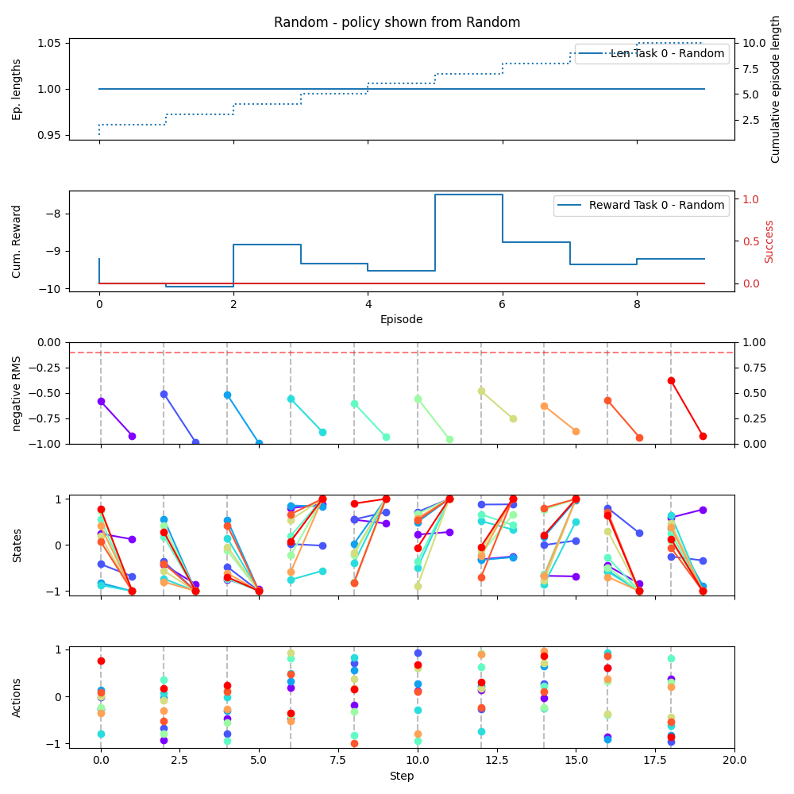
</div>

Sometimes this is the only option you have, if you know nothing about the environment. Does this make sense? How can you probe your system?

## 3. Running Model Predictive Control

Execute the script [`MPC_approach.py`](MPC_approach.py) to run the **Model Predictive Control (MPC)** approach on the **AWAKE** environment. MPC serves as a near-optimal control strategy based on a model of the environment's dynamics.

**Steps:**

1. **Run MPC Script:**

   ```bash
   python MPC_approach.py
   ```
2. **Overview:**
   - **Objective:** Achieve near-optimal solutions using a control-based approach.
   - **Methodology:** Utilizes **Sequential Least Squares Quadratic Programming (SLSQP)** for constrained optimization.
   - **Robustness:** Enhances stability by applying only the first action from the planned action sequence.

3. **Implementation Details:**
   - **Optimization:** Handled in [`helper_scripts/MPC.py`](helper_scripts/MPC.py).
   - **Validation:** Conducted within [`MPC_approach.py`](MPC_approach.py) across validation episodes to ensure performance consistency.
You should see something like (here for five DoF):
<div align="center">
  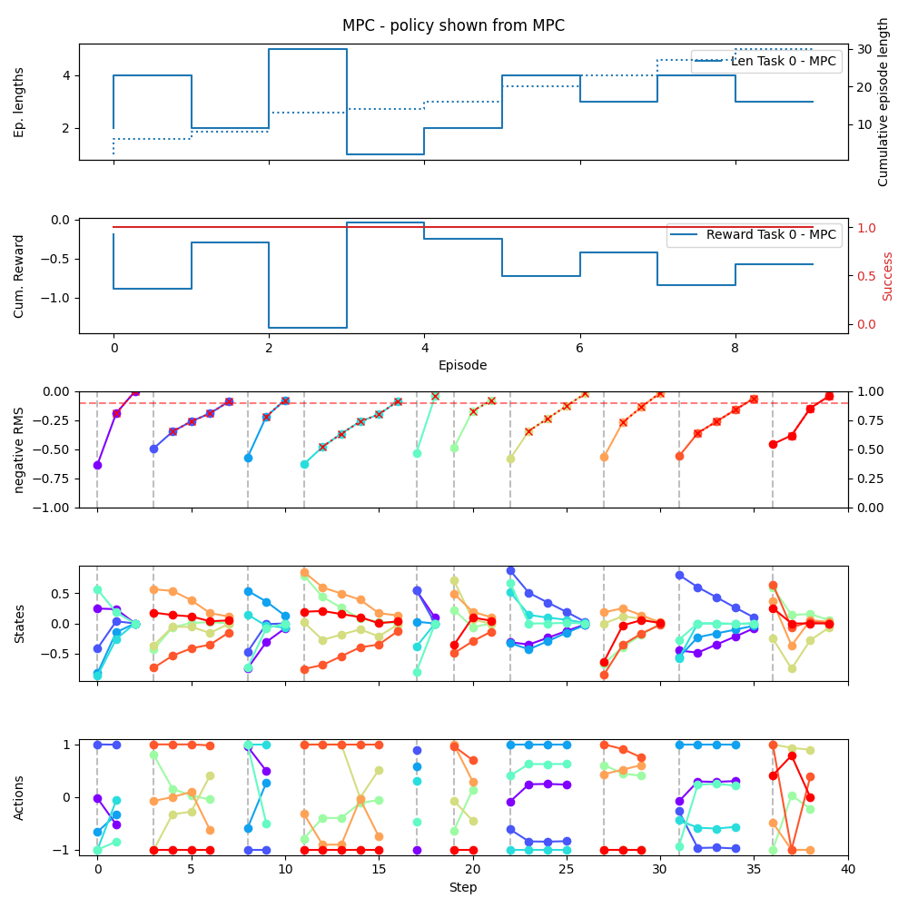
</div>


## 4. Training RL Agents

Train reinforcement learning agents using the script [`Train_policy_gradients_off_the_shelf.py`](RL_approach.py). This script implements training procedures for two mainstream RL algorithms: **Proximal Policy Optimization (PPO)** and **Trust Region Policy Optimization (TRPO)**.

**Steps:**

1. **Run RL Training Script:**

   ```bash
   python RL_approach.py
   ```

2. **Overview:**
   - **Algorithms:** Implements PPO and TRPO from the Stable Baselines library.
   - **Training Process:** Conducts training over `10,000` steps with `50` evaluation steps per validation episode.
   - **Evaluation:** Performs `ten` fixed validation episodes at defined training intervals to monitor agent performance.
   - **Visualization:** Generates plots showcasing validation statistics throughout the training process, enabling performance tracking and comparison.

You see alternating figures showing the test of the policy and the training progress:
   <table>
  <tr>
    <td align="center">
      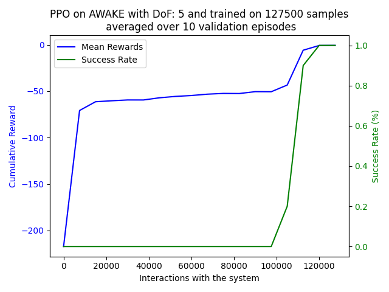
      <br>
      <sub>Figure 1: Learning progress of PPO during the training evaluated on our test episodes.</sub>
    </td>
    <td align="center">
      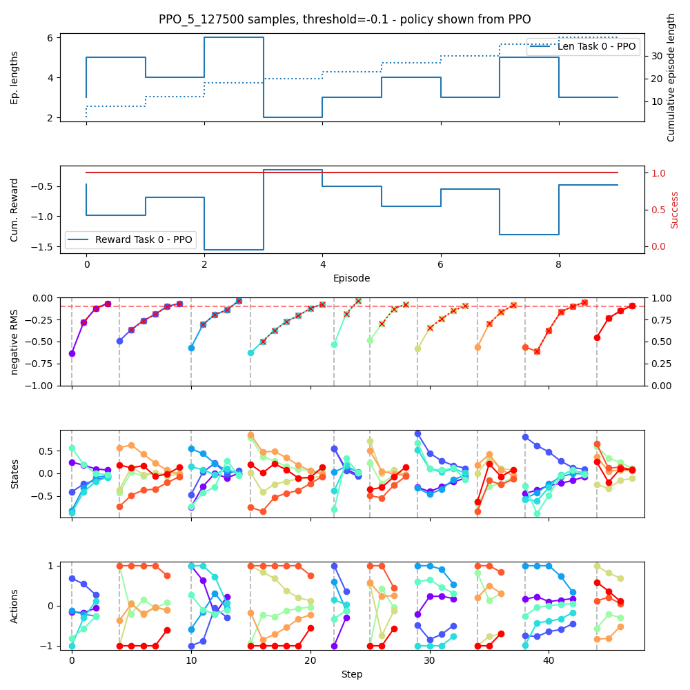
      <br>
      <sub>Figure 2: Test of PPO on our test episodes during the training.</sub>
    </td>
  </tr>
</table>


The following hyperparameters can be adjusted in the configuration file or directly in the training script to optimize the performance of the RL agents. We add brief explanations to provide insights into how each parameter influences the learning process, helping users make informed decisions when tuning the algorithms. The configuration file is located at [`config/environment_setting.yaml`](config/environment_setting.yaml) and explained in the upcoming sections in more detail.

TRPO (Trust Region Policy Optimization) uses the following key hyperparameters:

- `learning_rate`: Learning rate for the value function optimizer. Default: 1e-3
  - *Influences how quickly the value function is updated.*
- `n_steps`: Number of steps per environment update. Default: 2048
  - *Determines the amount of experience collected before each update.*
- `batch_size`: Minibatch size for value function updates. Default: 128
  - *Affects the stability and speed of value function training.*
- `gamma`: Discount factor. Default: 0.99
  - *Controls the importance of future rewards in decision-making.*
- `cg_max_steps`: Maximum steps in Conjugate Gradient algorithm. Default: 15
  - *Impacts the precision of the natural gradient computation.*
- `cg_damping`: Damping factor for Hessian vector product. Default: 0.1
  - *Helps stabilize the natural gradient computation.*
- `line_search_shrinking_factor`: Step-size reduction factor for line search. Default: 0.8
  - *Affects how conservatively the policy is updated.*
- `line_search_max_iter`: Maximum iterations for backtracking line search. Default: 10
  - *Limits the computational cost of finding an acceptable policy update.*
- `n_critic_updates`: Number of critic updates per policy update. Default: 10
  - *Balances the learning between policy and value function.*
- `gae_lambda`: Factor for Generalized Advantage Estimator. Default: 0.95
  - *Trades off bias vs. variance in advantage estimation.*
- `normalize_advantage`: Whether to normalize the advantage. Default: True
  - *Can improve training stability across different scales of rewards.*
- `target_kl`: Target KL divergence between updates. Default: 0.01
  - *Controls how conservative the policy updates are.*
- `sub_sampling_factor`: Factor for batch sub-sampling. Default: 1
  - *Can reduce computation time at the cost of using less data.*

PPO (Proximal Policy Optimization) uses the following key hyperparameters:

- `learning_rate`: Learning rate for the optimizer. Default: 3e-4
  - *Controls the step size of policy and value function updates.*
- `n_steps`: Number of steps per environment update. Default: 2048
  - *Determines the amount of experience collected before each update.*
- `batch_size`: Minibatch size for gradient updates. Default: 64
  - *Affects the stability and speed of training.*
- `n_epochs`: Number of optimization epochs. Default: 10
  - *Controls how many times the collected data is reused for updates.*
- `gamma`: Discount factor. Default: 0.99
  - *Determines the importance of future rewards in decision-making.*
- `gae_lambda`: Factor for Generalized Advantage Estimator. Default: 0.95
  - *Trades off bias vs. variance in advantage estimation.*
- `clip_range`: Clipping parameter for policy loss. Default: 0.2
  - *Limits the size of policy updates to improve stability.*
- `ent_coef`: Entropy coefficient for loss calculation. Default: 0.0
  - *Encourages exploration by adding an entropy bonus to the objective.*
- `vf_coef`: Value function coefficient for loss calculation. Default: 0.5
  - *Balances the importance of value function learning vs. policy learning.*
- `max_grad_norm`: Maximum value for gradient clipping. Default: 0.5
  - *Prevents excessively large gradient updates to improve stability.*

## 5. Comparing Approaches

After training, compare the performance of RL agents with the MPC and response matrix approaches using the script [`Compare_different_approaches.py`](Compare_different_approaches.py).

**Steps:**

1. **Run Comparison Script:**

   ```bash
   python Compare_different_approaches.py
   ```

2. **Overview:**
   - **Objective:** Evaluate and contrast the effectiveness of RL-based control against traditional MPC and response matrix methods.
   - **Metrics:** Analyzes key performance indicators such as reward accumulation, state deviations, and action efficiencies.
   - **Visualization:** Produces comparative plots to illustrate strengths and weaknesses of each approach, facilitating informed decisions on methodology suitability.

You see two figures:
<table>
  <tr>
    <td align="center">
      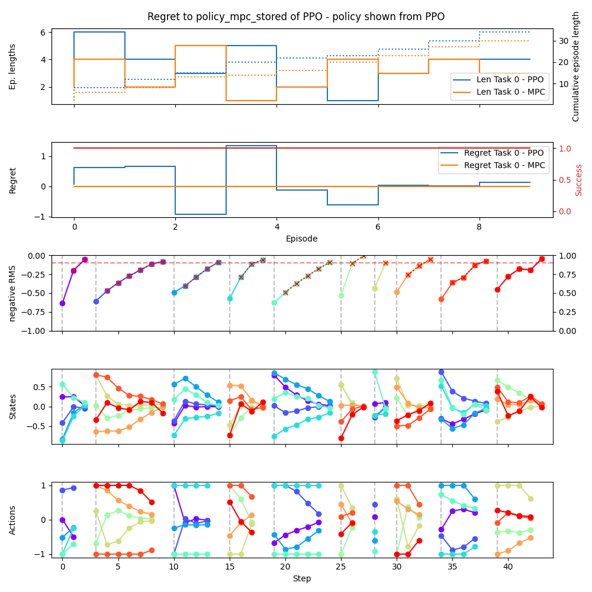
      <br>
      <sub>Figure 1: Regret of PPO to MPC.</sub>
    </td>
    <td align="center">
      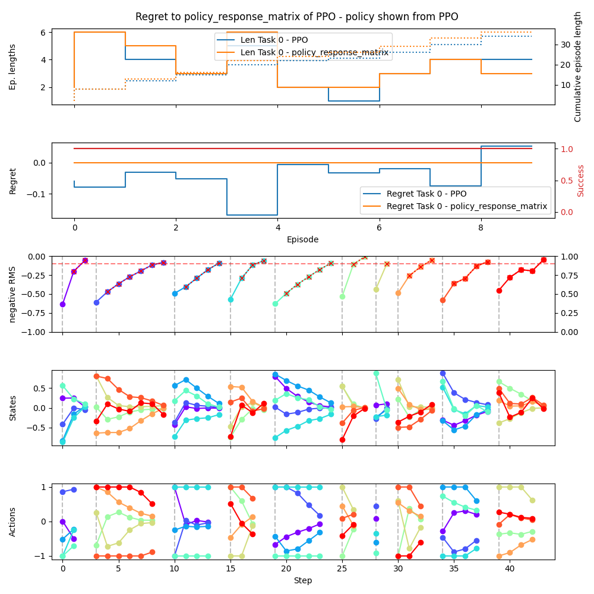
      <br>
      <sub>Figure 2: Regret of PPO to analytic approach.</sub>
    </td>
  </tr>
</table>


## 6. Running the GP-MPC Controller

Utilize the Gaussian Process-based Model Predictive Control (GP-MPC) framework to manage and optimize the Beam Steering Environment. This script integrates GP regression with MPC to handle uncertainties and complex dynamics effectively.

**Script:** [`GP_MPC_approach.py`](GP_MPC_approach.py)

**Steps:**

1. **Execute the GP-MPC Controller Script:**

   ```bash
   python Run_gp_mpc.py
   ```

2. **Overview:**
   - **Objective:** Implement and evaluate the GP-MPC controller within the Beam Steering Environment to achieve robust and adaptive control of beam parameters.
   - **Configuration:** Loads environment and controller settings from YAML configuration files, ensuring flexibility and ease of experimentation.
   - **Visualization:** Initializes live plotting tools to monitor real-time performance, including state trajectories, actions, and cost metrics.
   - **Control Loop:** Executes the control loop where the GP-MPC controller computes optimal actions based on current observations, interacts with the environment, and updates the model with new data.
   - **Outcome Logging:** Saves comprehensive results, including rewards, episode lengths, actions, and states, facilitating further analysis and benchmarking.


Two interactive figures open and show the live progress of the training:
<table>
  <tr>
    <td align="center">
      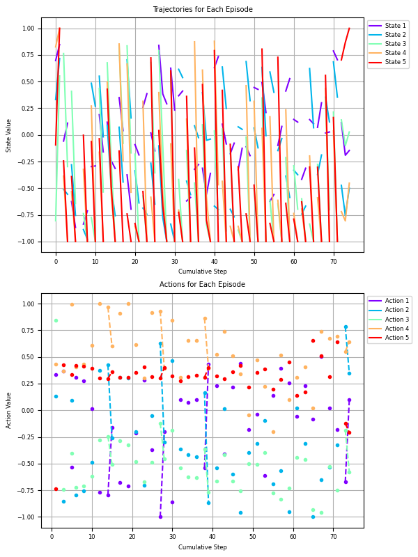
      <br>
      <sub>Figure 1: Detail view of the episodes during the training.</sub>
    </td>
    <td align="center">
      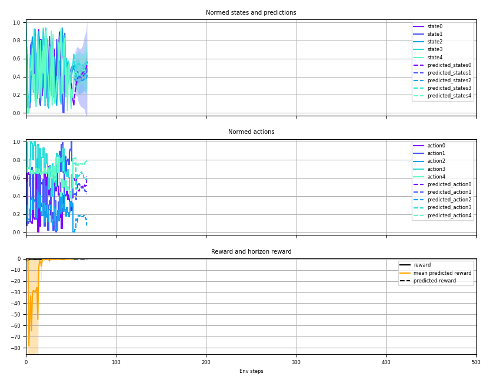
      <br>
      <sub>Figure 2: View of the reward and the states, actions including the prediction horizon.</sub>
    </td>
  </tr>
</table>

**Outcome:**

- **Performance Metrics:** Tracks cumulative rewards, success rates, and cost minimization, providing insights into the controller's effectiveness.
- **Visual Insights:** Real-time plots display state and action trajectories, enabling immediate assessment of control strategies.
- **Data Persistence:** Stores detailed results in organized folders for subsequent evaluation and comparison with other control approaches.
- **Adaptability Demonstration:** Showcases the GP-MPC controller's ability to adapt to dynamic changes and uncertainties within the Beam Steering Environment.

This script serves as a critical component in demonstrating the advantages of integrating Gaussian Processes with Model Predictive Control, highlighting its potential in managing complex and uncertain control scenarios effectively.
[GP-MP code source](#gp-mpc-approach-)
---

# Environment Components
The **RL Bootcamp Tutorial** leverages a custom Gym environment, `AwakeSteering`, tailored for beam steering tasks using reinforcement learning (RL). The environment is enhanced with several wrappers and helper functions to provide flexibility, scalability, and robust functionality.
## `AwakeSteering` Gym Environment
The script [environment_awake_steering.py](environment/environment_awake_steering.py) contains the original AWAKE
### Overview

`AwakeSteering` is a custom [OpenAI Gym](https://gym.openai.com/) environment designed for **beam steering** using **reinforcement learning** (RL). This environment simulates the control of beam parameters, allowing agents to learn optimal steering strategies to achieve desired beam states under various conditions.

### Features

- **Customizable Tasks:** Define specific steering goals and tasks to tailor the learning process.
- **Dynamic Response Matrices:** Adjust the environment's response based on the selected plane (horizontal or vertical), enabling versatile simulation scenarios.
- **Episode Management:** Control the duration and termination conditions of each episode, including thresholds and maximum time steps.
- **Seed Control:** Ensure reproducibility by setting seeds for the environment's random number generators.
- **Scalable Dimensions:** Automatically configures action and observation spaces based on the system's beam position monitors (BPMs) and correctors.

### Environment Specifications

- **Action Space:** Continuous space defined by the number of correctors. Actions are bounded between -1 and 1, representing normalized control inputs.
- **Observation Space:** Continuous space representing beam positions, scaled appropriately. Observations are bounded between -1 and 1.
- **Reward Function:** Negative Euclidean norm (L2 norm) of the observation, incentivizing the agent to minimize deviations from the desired beam state.
- **Termination Conditions:**
  - **Success:** When the reward exceeds a predefined threshold.
  - **Failure:** When the maximum number of time steps (`MAX_TIME`) is reached or when beam positions violate safety thresholds.

### Initialization Parameters

- `twiss` (optional): Twiss parameters for beam dynamics.
- `task` (optional): Dictionary containing `'goal'` and `'id'` to define the steering objective.
- `train` (optional): Boolean flag to set the environment in training mode.
- `MAX_TIME` (optional): Maximum number of steps per episode (default: 100).
- `boundary_conditions` (optional): Enable or disable boundary conditions.
- `seed` (optional): Seed for random number generation to ensure reproducibility.
- `plane` (optional): Specifies the plane of operation (`Plane.horizontal` or `Plane.vertical`).

### Methods

- **`step(action: np.ndarray)`**
  - Executes one time step within the environment.
  - **Args:**
    - `action`: Array of control inputs.
  - **Returns:**
    - `observation`: Current beam state.
    - `reward`: Reward obtained after taking the action.
    - `done`: Boolean indicating if the episode has ended.
    - `truncated`: Boolean indicating if the episode was truncated.
    - `info`: Additional information, including task ID and current step.

- **`reset(seed: Optional[int] = None, options: Optional[Dict[str, Any]] = None)`**
  - Resets the environment to an initial state.
  - **Args:**
    - `seed`: Seed for randomness.
    - `options`: Additional reset options.
  - **Returns:**
    - `observation`: Initial beam state.
    - `info`: Additional information.

- **`seed(seed: Optional[int] = None)`**
  - Sets the seed for the environment's random number generators.
  - **Args:**
    - `seed`: Seed value.
  - **Returns:**
    - List containing the seed.
### Usage Example

```python
import gym
from RL_bootcamp_tutorial.envs.awake_steering import AwakeSteering

# Initialize the environment
env = AwakeSteering(
    twiss=None,
    task={'goal': [responseH, responseV], 'id': 'task_1'},
    train=True,
    MAX_TIME=200,
    boundary_conditions=True,
    seed=42,
    plane=Plane.horizontal
)

# Reset the environment
observation, info = env.reset()

done = False
while not done:
    # Sample a random action
    action = env.action_space.sample()

    # Take a step in the environment
    observation, reward, done, truncated, info = env.step(action)

    # Render or process the observation as needed
    env.render()

    if done:
        break

# Close the environment
env.close()
```

[//]: # (### Contributing)

[//]: # ()
[//]: # (Contributions are welcome! Please follow the [contributing guidelines]&#40;CONTRIBUTING.md&#41; to submit issues or pull requests.)

[//]: # ()
[//]: # (### License)

[//]: # ()
[//]: # (This project is licensed under the [MIT License]&#40;LICENSE&#41;.)

### References

- [OpenAI Gym Documentation](https://www.gymlibrary.ml/)
- [Reinforcement Learning Overview](https://en.wikipedia.org/wiki/Reinforcement_learning)

---

### Key Imports

- **Standard Libraries:**
  - `logging`: Enables logging for debugging and information tracking.
  - `os`: Facilitates interaction with the operating system, such as file path manipulations.
  - `pickle`: Handles serialization and deserialization of Python objects.
  - `enum`: Provides support for enumeration classes.
  - `typing`: Offers type hints for improved code clarity and type checking.

- **Third-Party Libraries:**
  - `gymnasium as gym`: Core library for creating and interacting with RL environments.
  - `matplotlib`: Utilized for data visualization and plotting.
    - `matplotlib.cm as cm`
    - `matplotlib.lines as mlines`
    - `matplotlib.pyplot as plt`
  - `numpy as np`: Supports numerical operations and array manipulations.
  - `pandas as pd`: Facilitates data manipulation and analysis.
  - `yaml`: Parses YAML configuration files for environment settings.

- **Custom Modules:**
  - `environment.environment_awake_steering import AwakeSteering`: Imports the custom `AwakeSteering` environment.

### Core Classes

- **`Plane` (Enum):**
  - Defines operational planes for the environment:
    - `horizontal = 0`
    - `vertical = 1`

- **`DoFWrapper` (gym.Wrapper):**
  - **Purpose:** Restricts the environment to a specified number of Degrees of Freedom (DoF).
  - **Functionality:**
    - Adjusts action and observation spaces to include only the first `DoF` elements.
    - Modifies reward and termination conditions based on the limited observations.
    - Scales actions and applies penalties as configured.

- **`Awake_Benchmarking_Wrapper` (gym.Wrapper):**
  - **Purpose:** Provides benchmarking capabilities by tracking and evaluating optimal trajectories and actions.
  - **Functionality:**
    - Computes optimal actions using inverse response matrices.
    - Records and visualizes state-action-reward trajectories.
    - Facilitates comparison between agent performance and optimal policies.

- **`RewardScalingWrapper` (gym.Wrapper):**
  - **Purpose:** Scales rewards to adjust the learning incentives for the RL agent.
  - **Functionality:**
    - Multiplies rewards by a specified scaling factor.
    - Introduces minor noise to observations to enhance robustness.

- **`SmartEpisodeTrackerWithPlottingWrapper` (gym.Wrapper):**
  - **Purpose:** Tracks and visualizes episode data in real-time.
  - **Functionality:**
    - Records states, actions, and rewards for each episode.
    - Generates dynamic plots for state trajectories and action sequences.
    - Highlights successful steps and episode durations.

- **`EpisodeData`:**
  - **Purpose:** Serves as a container for storing data related to individual episodes.
  - **Functionality:**
    - Stores lists of states, actions, and rewards.
    - Tracks the completion status of episodes.

### Helper Functions

- **`load_predefined_task(task_nr, task_location)`**
  - **Purpose:** Loads predefined tasks from a specified location using `pickle`.
  - **Functionality:** Retrieves task configurations for initializing the environment.

- **`plot_results(states, actions, rewards, env, title)`**
  - **Purpose:** Visualizes the states, actions, and rewards of a single episode.
  - **Functionality:** Generates subplots for each component and marks threshold crossings.

- **`plot_optimal_policy(states_opt_list, actions_opt_list, returns_opt_list, env)`**
  - **Purpose:** Plots optimal policies across multiple episodes.
  - **Functionality:** Aggregates and visualizes state trajectories, actions, and rewards.

- **`read_experiment_config(filepath)`**
  - **Purpose:** Reads and parses a YAML configuration file.
  - **Functionality:** Loads environment and task settings for initializing the environment.

- **`get_model_parameters(environment)`**
  - **Purpose:** Extracts and processes model parameters for Model Predictive Control (MPC).
  - **Functionality:** Retrieves and scales the action matrix and defines MPC thresholds.

- **`load_env_config(env_config)`**
  - **Purpose:** Loads environment configurations and initializes the environment with appropriate wrappers.
  - **Functionality:** Sets up tasks, degrees of freedom, terminal conditions, and scaling factors based on YAML configurations.

- **`plot_trajectories_and_actions(env, n_episodes)`**
  - **Purpose:** Plots trajectories and actions for a specified number of episodes.
  - **Functionality:** Iteratively runs episodes and visualizes the resulting state and action sequences.

### Usage Example

```python
import gym
from environment.environment_awake_steering import AwakeSteering

# Initialize the base environment
env = AwakeSteering(
    task={'goal': [responseH, responseV], 'id': 'task_1'},
    MAX_TIME=200
)

# Wrap the environment to limit Degrees of Freedom
wrapped_env = DoFWrapper(
    env=env,
    DoF=5,
    boundary_conditions=True,
    init_scaling=1.0,
    action_scale=1.0,
    penalty_scaling=1.0
)

# Further wrap with benchmarking capabilities
benchmark_env = Awake_Benchmarking_Wrapper(wrapped_env)

# Interact with the environment
observation, info = benchmark_env.reset()
done = False
while not done:
    action = benchmark_env.action_space.sample()
    observation, reward, done, truncated, info = benchmark_env.step(action)
    benchmark_env.render()

# Close the environment
benchmark_env.close()
```

By utilizing the `AwakeSteering` environment, you can develop and train reinforcement learning agents to perform beam steering tasks effectively. Whether you're conducting research or developing practical applications, this environment provides a robust foundation for your RL experiments.
```yaml
# Configuration File for RL Bootcamp Tutorial

# Degrees of Freedom: Specifies the number of control inputs and observed states in the environment.
degrees-of-freedom: 10

# Terminal Conditions: Defines conditions under which an episode ends.
terminal-conditions:
  # Maximum number of steps allowed per episode.
  MAX-TIME: 1000

  # Whether to enforce boundary conditions on beam positions.
  boundary-conditions: true

  # Scaling factor applied to penalties when boundary conditions are violated.
  penalty-scaling: 10.0

# MPC (Model Predictive Control) Settings: Parameters for the MPC algorithm.
mpc-settings:
  # Length of the prediction horizon for MPC.
  horizon-length: 8

  # Tolerance for convergence in the MPC solver.
  tol: 1.0e-8

  # Whether to display solver output during optimization.
  disp: False

# RL (Reinforcement Learning) Settings: Parameters for the RL algorithm.
rl-settings:
  # RL algorithm to use. Examples: 'PPO', 'TRPO' from Stable Baselines.
  algorithm: 'PPO' # 'TRPO' ... from stable baselines

  # Total number of training steps for the RL agent.
  total_steps: 10000

  # Number of steps between each evaluation of the RL agent.
  evaluation_steps: 50

  # PPO specific hyperparameters
  ppo:
    learning_rate: 3.0e-4
    ...

  # TRPO specific hyperparameters
  trpo:
    learning_rate: 1.0e-3
    ...

# Advanced Settings
# Note: Modify these settings only if necessary.
noise_setting:
  # Standard deviation of noise added to observations. Set to 'none' to disable noise.
  std_noise: none

# Initial Scaling: Scaling factor applied to initial observations to normalize state values.
init_scaling: 0.9

# Action Scale: Scaling factor applied to actions to control the magnitude of control inputs.
action_scale: 1.0

# Validation Settings: Parameters for validating the trained RL agent.
validation-settings:
  # Seeds used for reproducible validation runs.
  validation-seeds: [0, 2, 3, 4, 5, 7, 8, 11, 12, 14]

# Task Settings: Defines which task to load and its location.
task_setting:
  # Path to the file containing predefined tasks for verification.
  task_location: 'environment/tasks/verification_tasks.pkl'

  # Task number to load from the task file.
  task_nr: 0
```

### Description of Configuration Parameters

- **degrees-of-freedom:**
  Determines the number of control inputs and observed states the RL agent will interact with. Setting this value adjusts the complexity and dimensionality of the environment.

- **terminal-conditions:**
  - **MAX-TIME:**
    The maximum number of steps an episode can run before it is forcibly terminated. Useful for preventing excessively long episodes.

  - **boundary-conditions:**
    When set to `true`, the environment enforces boundary conditions on beam positions, ensuring they remain within safe operational limits.

  - **penalty-scaling:**
    A multiplier applied to penalties incurred when boundary conditions are violated. Higher values increase the severity of penalties, encouraging the agent to avoid such violations.

- **mpc-settings:**
  Parameters governing the Model Predictive Control (MPC) algorithm used within the environment.
  - **horizon-length:**
    The number of future steps the MPC considers when optimizing actions.

  - **tol:**
    The numerical tolerance for convergence in the MPC solver. Smaller values require more precise solutions.

  - **disp:**
    Enables (`True`) or disables (`False`) the display of solver output during optimization.

- **rl-settings:**
  Configuration for the Reinforcement Learning (RL) algorithm employed.
  - **algorithm:**
    Specifies the RL algorithm to use, such as Proximal Policy Optimization (`'PPO'`) or Trust Region Policy Optimization (`'TRPO'`), typically sourced from libraries like Stable Baselines.

  - **total_steps:**
    The total number of training steps the RL agent will undergo.

  - **evaluation_steps:**
    The frequency (in steps) at which the agent's performance is evaluated during training.

- **noise_setting:**
  - **std_noise:**
    Defines the standard deviation of noise added to observations. Setting this to `'none'` disables noise, allowing for deterministic observations.

- **init_scaling:**
  A scaling factor applied to initial observations to normalize state values, aiding in stabilizing the learning process.

- **action_scale:**
  Scales the magnitude of actions taken by the RL agent, allowing for control over the aggressiveness of actions.

- **validation-settings:**
  Parameters related to the validation phase of the RL agent.
  - **validation-seeds:**
    A list of seeds ensuring reproducible validation runs, allowing consistent evaluation across different runs.

- **task_setting:**
  - **task_location:**
    The file path to the pickle file containing predefined tasks used for environment verification and benchmarking.

  - **task_nr:**
    The specific task number to load from the `verification_tasks.pkl` file, enabling targeted testing of the environment.

### How to Use This Configuration

1. **Locate the Configuration File:**
   Ensure that the configuration file (e.g., `config.yaml`) is placed in the appropriate directory within the repository, typically at the root or within a `config/` folder.

2. **Modify Parameters as Needed:**
   Adjust the parameters to suit your specific experimentation needs. For instance:
   - Change `degrees-of-freedom` to increase or decrease the complexity of the environment.
   - Modify `rl-settings` to switch between different RL algorithms or adjust training durations.

3. **Advanced Settings:**
   Only alter the advanced settings if you have a clear understanding of their impact. These settings control finer aspects of the environment and agent behavior.

4. **Running the Tutorial:**
   When executing the tutorial scripts, ensure they reference the correct configuration file. This allows the environment and RL agent to initialize with your specified settings.

5. **Validation and Benchmarking:**
   Utilize the `validation-settings` to perform consistent and reproducible evaluations of your RL agent's performance across different configurations and seeds.

---

## Additional Resources

- **Documentation:**
  - [OpenAI Gymnasium Documentation](https://gymnasium.farama.org/)
  - [Stable Baselines3 Documentation](https://stable-baselines3.readthedocs.io/)

---

[//]: # (## Contributing)

[//]: # ()
[//]: # (Contributions are welcome! If you encounter issues or have suggestions for improvements, please open an issue or submit a pull request. Ensure that your contributions adhere to the project's coding standards and include relevant documentation.)

[//]: # ()
[//]: # (---)

[//]: # ()
[//]: # (## License)

[//]: # ()
[//]: # (This project is licensed under the [MIT License]&#40;LICENSE&#41;.)

[//]: # ()
[//]: # (---)


[//]: # ()
[//]: # ()
[//]: # (# Tutorial in Reinforcement Learning of the [RL-Bootcamp Salzburg 24]&#40;https://sarl-plus.github.io/RL-Bootcamp/&#41;)

[//]: # ()
[//]: # (## Getting Closer to Real-World Reinforcement Learning Applications)

[//]: # ()
[//]: # ([Simon Hirlaender]&#40;https://mathphyssim.github.io&#41;, Olga Mironova, Catherine Laflamme, Thomas Gallien, Marius-Constantin Dinu)

[//]: # ()
[//]: # (Welcome to the **RL Bootcamp Tutorial**! This tutorial guides you through implementing reinforcement learning &#40;RL&#41; techniques for beam steering in a control-theoretical framework. We'll explore various approaches, compare their effectiveness, and conduct a comprehensive noise study to evaluate performance under different conditions.)

## RL Bootcamp Tutorial Installation Guide

Welcome to the **RL Bootcamp Tutorial**! This guide will help you set up a Python environment using `requirements.txt` to ensure you have all the necessary dependencies to run the tutorials smoothly. Follow the steps below to get started.

### Table of Contents

- [Prerequisites](#prerequisites)
- [Step 1: Install Python 3.11.9 or Higher](#step-1-install-python-3119-or-higher)
  - [On Windows](#on-windows)
  - [On macOS](#on-macos)
- [Step 2: Clone the Repository](#step-2-clone-the-repository)
- [Step 3: Create a Virtual Environment](#step-3-create-a-virtual-environment)
- [Step 4: Activate the Virtual Environment](#step-4-activate-the-virtual-environment)
  - [On Windows](#on-windows-1)
  - [On macOS/Linux](#on-macoslinux)
- [Step 5: Install Dependencies](#step-5-install-dependencies)
- [Step 6: Verify the Installation](#step-6-verify-the-installation)
- [Step 7: Deactivate the Virtual Environment](#step-7-deactivate-the-virtual-environment)
- [Additional Tips](#additional-tips)
- [Troubleshooting](#troubleshooting)
- [Further Assistance](#further-assistance)

---

### Prerequisites

Before you begin, ensure you have the following installed on your system:

- **Git**: [Install Git](https://git-scm.com/downloads)
- **Python 3.11.9 or higher**: [Download Python](https://www.python.org/downloads/)
- **pip**: Comes bundled with Python. Verify installation with `pip --version`

---

### Step 1: Install Python 3.11.9 or Higher

#### On Windows

1. **Download the Python Installer:**

   - Visit the [Python Downloads for Windows](https://www.python.org/downloads/windows/) page.
   - Download the latest Python 3.11.x installer (e.g., `python-3.11.9-amd64.exe`).

2. **Run the Installer:**

   - Locate the downloaded `.exe` file and double-click to run it.
   - **Important:** Check the box that says `Add Python 3.11 to PATH`.
   - Click on `Install Now`.
   - Follow the on-screen instructions to complete the installation.

3. **Verify the Installation:**

   - Open Command Prompt (`Win + R`, type `cmd`, and press `Enter`).
   - Run:
     ```bash
     python --version
     ```
     You should see:
     ```
     Python 3.11.9
     ```

#### On macOS

1. **Download the Python Installer:**

   - Visit the [Python Downloads for macOS](https://www.python.org/downloads/macos/) page.
   - Download the latest Python 3.11.x installer (e.g., `python-3.11.9-macosx10.9.pkg`).

2. **Run the Installer:**

   - Locate the downloaded `.pkg` file and double-click to run it.
   - Follow the installation prompts, agreeing to the license and selecting the installation location.

3. **Verify the Installation:**

   - Open Terminal (`Command + Space`, type `Terminal`, and press `Enter`).
   - Run:
     ```bash
     python3 --version
     ```
     You should see:
     ```
     Python 3.11.9
     ```

---

### Step 2: Clone the Repository

Clone the **RL Bootcamp Tutorial** repository to your local machine using Git.

1. **Open Terminal or Command Prompt.**

2. **Run the Clone Command:**

   ```bash
   git clone https://github.com/SARL-PLUS/RL_bootcamp_tutorial.git
   ```

3. **Navigate to the Project Directory:**

   ```bash
   cd RL_bootcamp_tutorial
   ```

---

### Step 3: Create a Virtual Environment

Creating a virtual environment isolates your project's dependencies from other Python projects on your system.

1. **Run the Following Command:**

   ```bash
   python3 -m venv venv
   ```

   - **Explanation:**
     - `python3`: Specifies the Python interpreter. Use `python` if `python3` is not recognized.
     - `-m venv`: Uses the `venv` module to create a virtual environment.
     - `venv`: The name of the virtual environment directory. You can name it differently if preferred.

---

### Step 4: Activate the Virtual Environment

Before installing dependencies, activate the virtual environment.

#### On Windows

1. **Run the Activation Script:**

   ```bash
   venv\Scripts\activate
   ```

2. **Confirmation:**

   - Your command prompt should now be prefixed with `(venv)` indicating that the virtual environment is active.
     ```
     (venv) C:\Path\To\RL_bootcamp_tutorial>
     ```

#### On macOS/Linux

1. **Run the Activation Script:**

   ```bash
   source venv/bin/activate
   ```

2. **Confirmation:**

   - Your terminal prompt should now be prefixed with `(venv)` indicating that the virtual environment is active.
     ```
     (venv) your-mac:RL_bootcamp_tutorial user$
     ```

---

### Step 5: Install Dependencies

With the virtual environment activated, install the required Python packages using the `requirements.txt` file.

```bash
pip install -r requirements.txt
```

- **Notes:**
  - Ensure that the `requirements.txt` file is present in the project directory.
  - This command installs all packages listed in `requirements.txt` into the virtual environment.

---

### Step 6: Verify the Installation

To confirm that all dependencies are installed correctly, list the installed packages.

```bash
pip list
```

**Expected Output:**

A list of installed packages along with their versions, matching those specified in `requirements.txt`.

```
Package         Version
--------------- -------
numpy           1.23.1
pandas          1.4.2
...
```

---

### Troubleshooting

- **`pip` Not Found:**

  - Ensure that the virtual environment is activated.
  - Verify that Python and `pip` are correctly installed and added to your system's PATH.

- **Permission Issues:**

  - Avoid using `sudo` with `pip`. Instead, use a virtual environment.
  - If necessary, add the `--user` flag:
    ```bash
    pip install --user -r requirements.txt
    ```

- **Virtual Environment Activation Issues:**

  - **macOS/Linux:**
    - Ensure that the activation script has execute permissions.
    - If you encounter a "permission denied" error, run:
      ```bash
      chmod +x venv/bin/activate
      ```

  - **Windows:**
    - If you receive an execution policy error, open PowerShell as an administrator and run:
      ```powershell
      Set-ExecutionPolicy RemoteSigned
      ```
    - Then, try activating the virtual environment again.

- **Incompatible Python Version:**

  - Ensure that the active Python interpreter is **3.11.9** or higher.
  - You can specify the Python version when creating the virtual environment:
    ```bash
    python3.11 -m venv venv
    ```
    *Replace `python3.11` with the path to the desired Python executable if necessary.*

- **Missing `requirements.txt`:**

  - Ensure that you are in the correct project directory.
  - If `requirements.txt` is missing, you may need to generate it or obtain it from the repository.

---

### Further Assistance

- **Official Python Documentation:** [https://docs.python.org/3/](https://docs.python.org/3/)
- **Git Documentation:** [https://git-scm.com/doc](https://git-scm.com/doc)
- **Virtual Environments (`venv`):** [https://docs.python.org/3/library/venv.html](https://docs.python.org/3/library/venv.html)
- **Pip Documentation:** [https://pip.pypa.io/en/stable/](https://pip.pypa.io/en/stable/)
- **Community Support:**
  - [Stack Overflow](https://stackoverflow.com/)
  - [Python Discord](https://pythondiscord.com/)
  - [GitHub Discussions](https://github.com/SARL-PLUS/RL_bootcamp_tutorial/discussions)

---

# References
#### A good resource for linear dynamics and control
A good resource for linear dynamics is: Margellos, K. (2023). *B15 Linear Dynamic Systems and Optimal Control*. Michaelmas Term, University of Oxford. Email: [kostas.margellos@eng.ox.ac.uk](mailto:kostas.margellos@eng.ox.ac.uk)

#### References on Model Predictive Control (MPC)

1. **Maciejowski, J. M. (2002).** _Predictive Control: with Constraints_. Prentice Hall.
   - This book provides an in-depth look at predictive control, focusing on practical applications and incorporating constraints into control strategies.

2. **Camacho, E. F., & Bordons, C. (2004).** _Model Predictive Control_. Springer.
   - A foundational text that covers the basics of MPC, detailing the principles and practical implementations of the control strategy.

3. **Rawlings, J. B., & Mayne, D. Q. (2009).** _Model Predictive Control: Theory and Design_. Nob Hill Publishing.
   - Offers rigorous discussion on the theoretical aspects of MPC, with a strong emphasis on the design and stability of control systems.

4. **Qin, S. J., & Badgwell, T. A. (2003).** "A survey of industrial model predictive control technology." _Control Engineering Practice_, 11(7), 733-764.
   - This survey paper explores the application of MPC in industrial settings, discussing advancements, challenges, and practical insights.

5. **Mayne, D. Q., Rawlings, J. B., Rao, C. V., & Scokaert, P. O. M. (2000).** "Constrained model predictive control: Stability and optimality." _Automatica_, 36(6), 789-814.
   - A critical paper that discusses the stability and optimality of MPC, particularly when constraints are applied to the control process.

6. **Rossiter, J. A. (2003).** _Model-Based Predictive Control: A Practical Approach_. CRC Press.
   - Designed for both practitioners and researchers, this book navigates through the practical aspects of predictive control with real-world case studies.

#### References on optimisation:
1. **Nocedal, J., & Wright, S. J. (2006).** _Numerical Optimization_. Springer.
   - This comprehensive text provides an in-depth exploration of numerical methods for optimization, making it essential for understanding the computational techniques used in various optimization problems.

2. **Boyd, S., & Vandenberghe, L. (2004).** _Convex Optimization_. Cambridge University Press.
   - A seminal book that introduces the fundamentals of convex optimization and its applications in a clear and concise manner. It is particularly valuable for its theoretical insights and practical problem-solving strategies.

3. **Bertsekas, D. P. (1999).** _Nonlinear Programming (2nd Edition)_. Athena Scientific.
   - Focuses on the theory and methods for nonlinear optimization, providing rigorous coverage of algorithms and their convergence properties.

4. **Chong, E. K. P., & Zak, S. H. (2013).** _An Introduction to Optimization (4th Edition)_. Wiley.
   - This textbook offers a broad introduction to optimization with applications across engineering, science, and economics. It covers both theoretical aspects and practical algorithms.

5. **Fletcher, R. (1987).** _Practical Methods of Optimization (2nd Edition)_. Wiley.
   - Explains practical techniques and methods used in optimization, suitable for those who need to solve real-world problems. This book emphasizes practical algorithms over theoretical analysis.

6. **Bazaraa, M. S., Sherali, H. D., & Shetty, C. M. (2006).** _Nonlinear Programming: Theory and Algorithms (3rd Edition)_. Wiley-Interscience.
   - Offers a comprehensive treatment of the theory of nonlinear programming, detailed explanations of algorithmic methods, and an extensive set of application examples.

7. **Luenberger, D. G., & Ye, Y. (2008).** _Linear and Nonlinear Programming (3rd Edition)_. Springer.
   - Provides an in-depth look at both linear and nonlinear programming, with a strong emphasis on solution techniques and special algorithms.

8. **Arrow, K. J., Hurwicz, L., & Uzawa, H. (1958).** _Studies in Linear and Non-Linear Programming_. Stanford University Press.
   - This classic collection of papers by prominent economists introduces foundational concepts in linear and non-linear programming and their implications for economic theory.

9. **Gill, P. E., Murray, W., & Wright, M. H. (1981).** _Practical Optimization_. Academic Press.
   - This book is designed for practitioners who need to apply optimization methods in their work. It explains practical considerations in the implementation of optimization methods.

10. **Polak, E. (1997).** _Optimization: Algorithms and Consistent Approximations_. Springer.
    - Focuses on optimization algorithms and the theory of consistent approximations, providing a solid foundation for understanding the convergence behavior of algorithms in optimization.

#### References on Reinforcement Learning

1. **Sutton, R. S., & Barto, A. G. (2018).** _Reinforcement Learning: An Introduction_. MIT Press.
   - This seminal text provides a comprehensive introduction to the field of reinforcement learning, covering both the theoretical underpinnings and practical algorithms.
2. **Szepesvári, C. (2010).** _Algorithms for Reinforcement Learning_. Morgan and Claypool Publishers.
   - A concise overview of the core algorithms in reinforcement learning, geared towards students and researchers familiar with machine learning.
3. **Bertsekas, D. P., & Tsitsiklis, J. N. (1996).** _Neuro-Dynamic Programming_. Athena Scientific.
   - This book explores the intersection of dynamic programming and neural networks, offering insights into the development of efficient algorithms for RL.
5. **Kaelbling, L. P., Littman, M. L., & Moore, A. W. (1996).** "Reinforcement learning: A survey." _Journal of Artificial Intelligence Research_, 4, 237-285.
   - This survey provides an extensive overview of the field, discussing the foundational theories, significant challenges, and major directions in RL research.
6. **Arulkumaran, K., Deisenroth, M. P., Brundage, M., & Bharath, A. A. (2017).** "Deep reinforcement learning: A brief survey." _IEEE Signal Processing Magazine_, 34(6), 26-38.
   - This survey reviews deep reinforcement learning, focusing on its success in various domains and discussing the integration of deep learning techniques with reinforcement learning frameworks.

#### References on the analytical approach
1. **Moore, B. (1981).** "Principal component analysis in linear systems: Controllability, observability, and model reduction." _IEEE Transactions on Automatic Control_, 26(1), 17-32.
   - This pioneering paper introduces the use of principal component analysis, which relies on SVD, for reducing the complexity of linear systems in control engineering, particularly focusing on controllability and observability.

2. **Van Overschee, P., & De Moor, B. (1996).** _Subspace Identification for Linear Systems: Theory — Implementation — Applications_. Kluwer Academic Publishers.
   - This book details the subspace identification method, which uses SVD to identify state-space models from data, applicable in various control system applications.

3. **Liu, Y., & Anderson, B. D. O. (1989).** "Singular value decomposition for controller reduction." _Automatica_, 25(4), 659-664.
   - Discusses how SVD can be utilized for controller reduction, improving the efficiency and performance of large-scale control systems by simplifying the controller design.

4. **Golub, G. H., & Van Loan, C. F. (2013).** _Matrix Computations (4th Edition)_. Johns Hopkins University Press.
   - While not solely focused on control problems, this comprehensive text includes discussions on the application of SVD in various numerical methods and algorithms, which are fundamental in control engineering.

5. **Zhou, K., & Doyle, J. C. (1998).** _Essentials of Robust Control_. Prentice Hall.
   - Provides a broader look at control techniques including those involving SVD, especially in the context of developing robust control systems that can handle uncertainty and model inaccuracies.

6. **Tomizuka, M. (1987).** "Zero phase error tracking algorithm for digital control." _Journal of Dynamic Systems, Measurement, and Control_, 109(1), 65-68.
   - Discusses the use of SVD in optimizing control algorithms, specifically in achieving zero phase error in tracking applications.

7. **Skelton, R. E., Iwasaki, T., & Grigoriadis, K. (1998).** _A Unified Algebraic Approach to Linear Control Design_. Taylor & Francis.
   - This book offers an integrated approach to control design, with sections dedicated to using SVD for analyzing and designing control systems, emphasizing its value in ensuring system stability and performance.
#### Standard text books on GPs
Gaussian Processes (GP) are powerful tools in statistics and machine learning for modeling and inference in various applications. The following are some of the standard and highly recommended books that provide comprehensive coverage of Gaussian Processes, ranging from foundational theories to practical implementations:

1. **Rasmussen, C. E., & Williams, C. K. I. (2006).** _Gaussian Processes for Machine Learning_. MIT Press.
   - **Overview:** This is the seminal text on Gaussian Processes, offering an in-depth exploration of their theoretical foundations and practical applications in machine learning. It covers topics such as regression, classification, and optimization using GP models.
   - **Key Features:**
     - Comprehensive introduction to GP theory.
     - Detailed explanations of kernel methods.
     - Practical guidance on implementing GP algorithms.
     - Numerous examples and exercises to reinforce learning.
   - **Link:** [Gaussian Processes for Machine Learning](http://www.gaussianprocess.org/gpml/)

2. **Murphy, K. P. (2012).** _Machine Learning: A Probabilistic Perspective_. MIT Press.
   - **Overview:** While not exclusively focused on Gaussian Processes, this book includes extensive coverage of GP as part of its broader discussion on probabilistic models in machine learning.
   - **Key Features:**
     - Integrates GP within the context of Bayesian methods.
     - Explains the relationship between GP and other probabilistic models.
     - Provides practical algorithms and implementation details.
   - **Link:** [Machine Learning: A Probabilistic Perspective](https://probml.github.io/pml-book/book1.html)

3. **Schölkopf, B., & Smola, A. J. (2002).** _Learning with Kernels: Support Vector Machines, Regularization, Optimization, and Beyond_. MIT Press.
   - **Overview:** This book delves into kernel methods, a fundamental component of Gaussian Processes. It provides a thorough understanding of the mathematical underpinnings and applications of kernel-based learning algorithms.
   - **Key Features:**
     - Detailed treatment of kernel functions and their properties.
     - Connections between Support Vector Machines and Gaussian Processes.
     - Advanced topics in regularization and optimization.
   - **Link:** [Learning with Kernels](https://www.bkz.ch/shop/learning-with-kernels_258071)

4. **Williams, C. K. I. (2006).** "Gaussian Processes for Machine Learning." _Ph.D. Dissertation_, University of Toronto.
   - **Overview:** This dissertation by Carl Edward Rasmussen, one of the leading experts in Gaussian Processes, provides a comprehensive treatment of GP theory and applications. It serves as a foundational resource for advanced studies in GP.
   - **Key Features:**
     - In-depth theoretical exposition of Gaussian Processes.
     - Extensive coverage of GP-based algorithms and methodologies.
     - Applications of GP in various domains.
   - **Link:** [Gaussian Processes for Machine Learning](http://www.gaussianprocess.org/gpml/drupal/)

#### Reference GP-MPC approach: 
1. S. Kamthe and M. Deisenroth, “Data-Efficient Reinforcement Learning with Probabilistic Model Predictive Control,” in Proceedings of the Twenty-First International Conference on Artificial Intelligence and Statistics, A. Storkey and F. Perez-Cruz, Eds., in Proceedings of Machine Learning Research, vol. 84. PMLR, 2018, pp. 1701–1710. [Online]. Available: https://proceedings.mlr.press/v84/kamthe18a.html
2. https://github.com/SimonRennotte/Data-Efficient-Reinforcement-Learning-with-Probabilistic-Model-Predictive-Control