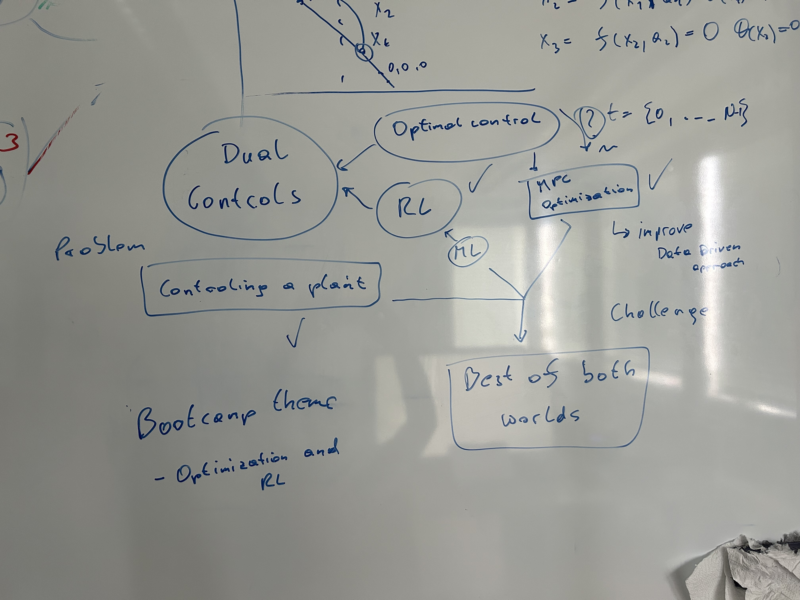

# Tutorial in Reinforcement Learning

Simon Hirlaender, Olga Mironova, ... 

## Short description of the content

1. The script [environment_awake_steering.py](environment_awake_steering.py) contains the original AWAKE 
environement and the wrapper to reduce the Degrees of Freedom (DoF) from one to the maximum of ten, 
as the original environement. 
2. The script [Train_policy_gradients_off_the_shelf.py](Train_policy_gradients_off_the_shelf.py) contains the training 
procedures of two main stream algorithms: PPO and TRPO. The training is done with ten fixed validation episodes done at a 
defined numer of training steps.
3. To visualize the progress helper functions are defined in [Visualize_policy_validation.py](Visualize_policy_validation.py).
4. To get the near optimal solution we use a control based approach, namely model predictive control (MPC). For this we need a model of the dynamics and the reward and use a sequential least squares quadratic programming (SLSQP), which is a constrained optimization. In order to get robust against errors we only use the first action from the planned action sequence. The optimization is in [MPC.py](MPC.py) and the validation on the validation episodes is in [MPC_approach.py](MPC_approach.py)
## Open questions for the programmes:
1. Reward shaping as a part of the turorial also as a contest?
2. One of the main goals is to understand every aspect of the MDP:
   * We discuss the initial distribution
   * We discuss the reward function and its equivalence classes
   * The episodic formulation within the MDP world
3. Difference between noise and partially observability

## Achievements:
### What should people learn?
- Understanding the basics of Reinforcement Learning (RL).
- Key components: agents, environments, states, actions, rewards, and policies.
- Differences between RL and other machine learning paradigms.
- Hands-on experience with simple RL algorithms like Q-learning and Deep Q-Networks (DQNs).
- Practical applications and limitations of RL.

### What are common pitfalls in the beginning?
- Underestimating the complexity of tuning hyperparameters.
- Overfitting to a specific environment or task.
- Misinterpreting results due to stochastic nature of RL.
- Neglecting the importance of exploration vs. exploitation trade-off.
- Insufficient computational resources for training complex models.

### What are the most important concepts?
- **Agent:** The learner or decision maker.
- **Environment:** The external system with which the agent interacts.
- **State:** A representation of the current situation of the agent.
- **Action:** A set of all possible moves the agent can make.
- **Reward:** Feedback from the environment to evaluate actions.
- **Policy:** The strategy that the agent employs to determine the next action based on the current state.
- **Value Function:** A prediction of future rewards.
- **Exploration vs. Exploitation:** Balancing the act of trying new actions vs. sticking to known rewarding actions.

### What can RL do for you?
- Solve complex decision-making problems.
- Optimize strategies in various fields like finance, robotics, gaming, and healthcare.
- Improve efficiency in dynamic systems by learning optimal policies.

### Why use RL? Is it the last hope?
- RL is used when there is a clear objective but the path to achieve it is not predefined.
- It's powerful for problems where the environment is dynamic and the agent needs to adapt and learn from interactions.
- While not the "last hope," RL provides a robust approach to problems where traditional methods fall short.

## Steps in the Tutorial:
1. **Real-world problems:**
   - Introduction to real-world problems that can be solved with RL.
   - Examples from different industries like robotics, healthcare, finance, etc.

2. **Press run agent:**
   - Provide a simple code to run an RL agent in a predefined environment.
   - Allow learners to see the immediate output and understand the interaction between agent and environment.

3. **Benchmark implementation:**
   - Compare different policies: optimal vs. naive.
   - Show how to implement and evaluate these policies in code.
   - Discuss the importance of benchmarking in RL.

4. **Code comments gap text:**
   - Provide code snippets with missing comments.
   - Engage learners to fill in the gaps, promoting active learning and better understanding of the code.

5. **Group discussions:**
   - Encourage learners to form groups and discuss questions.
   - Facilitate sessions where learners and experts debate and reach consensus on RL concepts and implementation strategies.

## Visual Ideas:
1. **Diagram of RL Components:**
   - Visual representation of the interaction between agent, environment, state, action, and reward.

2. **Flowchart of RL Process:**
   - Step-by-step flowchart showing the process of training an RL agent.

3. **Graphs and Charts:**
   - Performance comparison of different policies.
   - Reward over time graph to show learning progression.

4. **Code Snippets:**
   - Well-commented code snippets to illustrate key concepts.

- Visualize the RL process and key components.

- Depict a real-world problem being addressed by an RL agent.

