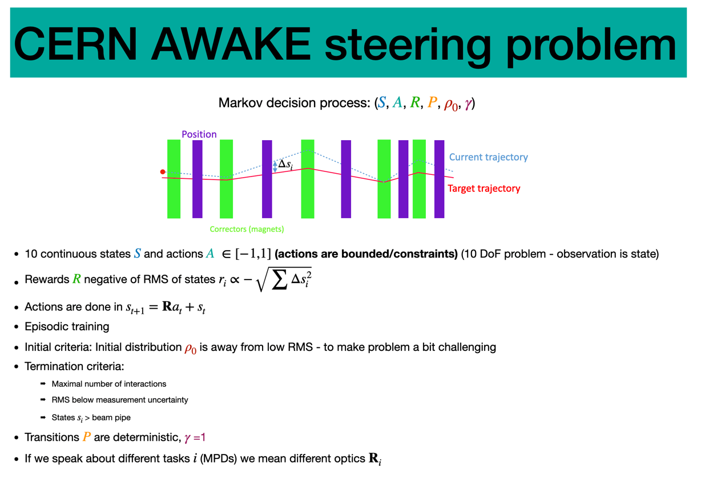

# Tutorial in Reinfocement Learning

### Achievements:
* What do people should learn?
* What are common bit falls in the beginning?
* What are the most important concepts?
* What can RL do for you?
* why do you use RL? Is it the last hope?

1. Real world problems 
2. Press run agent ?
3. Benchmark implemented (optimal policy and "naive" policy)
4. Code comments gap text
5. Groups which debates on questions, and we find a consent together with the experts 
### Visual Ideas

